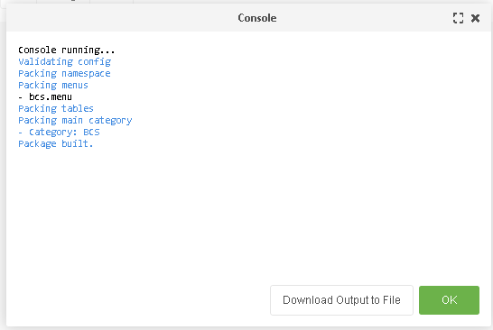

# About this Repo

This repository holds the docker-compose configuration intended to run a 
MODX3 development environment, from the basic infrastructure needed, to 
the git life cycle, all the needed components to get you up and running
developing modX extras.

## Prerequisites
1. Make sure you have the latest [docker](https://www.docker.com/) and 
   [docker-compose](https://docs.docker.com/compose/install/) installed 
2. After installing both components, make sure your docker instance is 
   running by clicking the docker system try icon => dashboard, this 
   should popup the docker dashboard, and you can check if the instance
   is running in the bottom left corner, if everything is correct, it should
   read "Docker running", with a green button ath the left side of the text.
3. For local development you'll need to a set of certs, those files are already
   part of the current repo inside the certs folder.  
   If you NEED to generate the ssl selfsigned 
   certificates, [here is a guide on how to do so](https://medium.com/the-new-control-plane/generating-self-signed-certificates-on-windows-7812a600c2d8)
   and place the `ssl.crt` and `ssl.key` files inside the certs folder.
4. Follow the wsl installation guide from the [microsoft site](https://docs.microsoft.com/en-us/windows/wsl/install-win10#manual-installation-steps)
   1. Make sure to select the plain 'Ubuntu' installation
   2. Follow the manual until you reach the following message  
   `CONGRATULATIONS! You've successfully installed and set up a Linux distribution that is completely integrated with your Windows operating system!`  
5. Go to Docker -> dashboard -> settings -> resources, and check that your new ubuntu image is listed, the click the switch next to it, and we'll be ready to go!

## Development environment

Looking to standardize environments and avoid the classical "it runs on my machine." we have based the project on a Docker container. Following are the steps needed to set up a development environment for the BCSPlatform.

Please follow the next steps to set up a local development environment.

- Make sure you have installed Docker Desktop
- Open a terminal
- Run:  
  `git clone git@github.com:Trotalo/modxBaseEnviroment.git BcsPlatform`
- Enter the project folder:  
  `cd BcsPlatform`
- Download the appropriate MODX version  
  `wget http://modx.com/download/direct/modx-3.0.3-pl.zip -P ./modxServer/installers/`
- Build the project images:    
  `docker-compose build`
- Run the project images. The next command will launch the server, be patient. The first time can take some time to start
  leave the tab open to keep the server running and be able to see the server output:    
  `docker-compose up`
- Open a browser and type the following url:   
  `https://localhost/manager/`  
  It should take you to the MODX manager. You can log in using admin/admin as credentials
- Update systems permissions:  
  `cd BcsPlatform/www`  
  `sudo chown -R www-data:www-data *`  
  `sudo chmod -R 0777 * `

- Now we are going to install [GPM](https://github.com/theboxer/Git-Package-Management/tree/3.x). This is  
  a tool that allows us to package our work as a MODX extra, which enables simpler version management as well as ease of installation.
   - Open a new terminal, go to your project route and run:  
     `docker exec bcsplatform-web-1 /bin/bash -c "./gpm/bin/gpm gpm:install --corePath=/var/www/html/core"`
   - Go to BcsPlatform/www/html and download this repo:    
     `git clone git@github.com:Trotalo/BCSPlatform.git bcs`
   - Use GPM to install the BCS package, open the MODX manager and install the package
     
     
   - Now install the BCS database:
     
   - Finally, using your favorite SQL tool, check that all the tables were created  
     

### Project structure
Here we describe the different folders inside the project and where the different parts of the code should be located

### Developing features
- Before starting any work, create a separate branch to keep track of your changes, and assign a branch_name based on the
  requirement you are working.  
  `git checkout -b branch_name`  
  Make the changes on your branch, and create multiple commits according to your work.

- Make sure you can generate a proper zip file for the extra, for this go to the GPM section on the manager, and select
  the build option:
  

- Check that the build was successful:  
  

- Check that the zip file was generated:  
  

- If everything is fine, push your changes. Make sure NOT TO PUSH THE ZIP FILE  
  `git push origin branch_name`

- Once you are done, create a pull request to add your changes to the master branch.

### Deploying to production

To ease the process of moving new versions to production, we use simple MODX transport packages, where we use the zip file
we generated on the previous steps and use it to install the BCSPlatform on any MODX instance.

- If you are doing an update instead of a clean installation, make sure to backup your information before installing the new
  version.

- Open the installation extras page inside the MODX manager.  
  

- Upload the zip file we generated on the previous step.  
  

- Select the file  
  

- Install the package
  

- Once you are done, if you were doing an version change, update the database with your latest backup

**ON DEVELOPMENT, WE CAN ADD A FEATURE TO THE TRANSPORT PACKAGE TO AUTOMATE BACKUP ON VERSION CHANGES**
